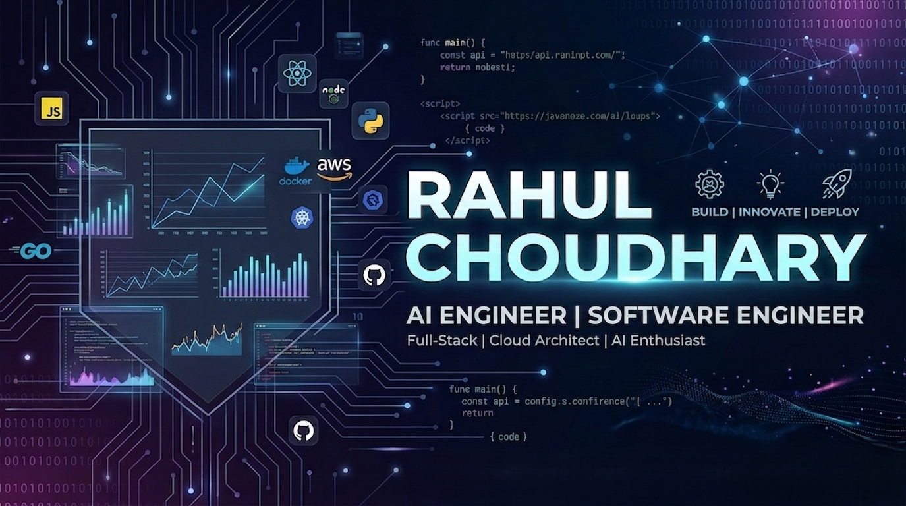

  

<h1 align="center">Hi 👋, I'm Rahul Choudhary</h1>

  

  
  
  

---

## 🧠 About Me

- 🚀 AI Engineer focused on **LLMs, RAG, and AI Agents**
- 🏗️ Build **end-to-end AI systems (data → embeddings → APIs → UI)**
- ⚡ Strong focus on **production-ready, scalable AI solutions**
- 🎯 Interested in **GenAI, intelligent automation, and real-world impact**

---

## 🎯 Focus Areas

- Production-grade **RAG pipelines**
- **LLM-powered applications** with memory + retrieval
- **Semantic search & vector databases**
- **AI system design (latency, scalability, modularity)**

---

## 🛠️ Tech Stack & Skills

| **Programming Languages** | **Frameworks & Libraries** |
| :--- | :--- |
|  |  |

| **AI / ML & Data** | **Databases & Vector Search** |
| :--- | :--- |
|   |   |

| **Generative AI & RAG** | **Tools & Systems** |
| :--- | :--- |
|     |    |

---

## 🚀 Featured Projects

### 🔹 Berkshire Hathaway Intelligence

- Built a **production-ready RAG AI agent** for financial Q&A  
- Designed full pipeline: *ingestion → embedding → retrieval → generation*  
- Indexed **100+ financial documents** for semantic search  
- ⚡ Achieved **<1s latency** with context-aware responses  
- 🧠 Added **memory + metadata filtering (↑35% relevance)**  

---

### 🔹 AI Financial Document Management System

- Built a **full-stack AI platform** for document intelligence  
- Implemented **RAG pipeline + semantic search**  
- Developed APIs (**FastAPI**) + frontend (**React**)  
- Designed **scalable modular architecture**  
- Enabled AI-driven insights from financial documents  

---

## 📈 What Makes Me Different

- I don’t just build models — I build **complete AI systems**
- Focus on **latency, retrieval quality, and real-world usability**
- Strong understanding of **RAG architecture (not just using APIs)**
- Experience with **production-style backend + AI integration**

---

## 📫 Let’s Connect

- 📧 rahulchoudhary5266@gmail.com  
- 💼 https://www.linkedin.com/in/rahulchoudhary2610  
- 💻 https://github.com/26rahulchoudhary  

---

## ⚡ Currently Exploring

- Advanced **multi-agent systems**
- Improving **RAG retrieval & reranking**
- Scaling **AI systems for real-world deployment**
